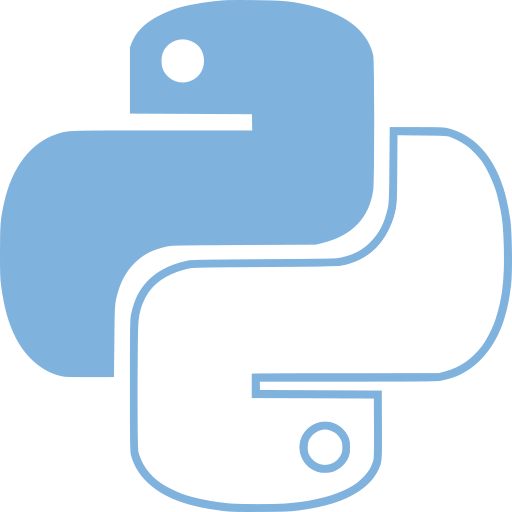

:title: Python para no pythonistas
:data-transition-duration: 1
:css: psm.css

----

:id: title

Python para no pythonistas
===========================



----
:id: wololo

- https://www.youtube.com/watch?v=3tBqdKGiqnI

----
:id: wololo

- Python Vigo
- VigoTech

----

:id: introduction-1

Python
======

* First release in 1991 by Guido van Rossum.
* Code readability
* Open source
* Comunity
* https://www.python.org/community/diversity/
* PSF. https://www.python.org/psf/
* Fun to use (Monty Python)

----

:id: introduction-2

Introduction
============

- Python (https://www.python.org/)
- Official documentation (https://docs.python.org/3/library/)
- Python Enhancement Proposals (PEP's). PEP8, PEP20. (https://www.python.org/dev/peps/)
- Versatilidad del lenguaje
- Grandes empresas que usan Python: Wikipedia, Google,Yahoo!, CERN, NASA,Facebook, Amazon, Instagram, Spotify.

----

:id: running-python

Running Python
===============

Install&Execute Python
----------------------
- Official https://www.python.org/downloads/
- Pyenv https://github.com/pyenv/pyenv
- Homebrew

	.. code:: python

		python --version
		python


----

Environments
============

- virtualenvs ( https://docs.python.org/3/library/venv.html)
- Never "sudo"

	.. code: python

		python3 -m venv .venv
		source .venv/bin/activate

----

Package manager
===============

- pip (https://packaging.python.org/tutorials/installing-packages/#ensure-you-can-run-pip-from-the-command-line)

	.. code: python

		pip install <package>

----

.. class:: substep

	- pipsi = pip script installer
	- pipenv


----

:id: tools-1

Tools:
======

- Flake8
- PEP8 https://legacy.python.org/dev/peps/pep-0008/
- https://legacy.python.org/dev/peps/pep-0008/#a-foolish-consistency-is-the-hobgoblin-of-little-minds

In particular: do not break backwards compatibility just to comply with this PEP!```

----

:id: tools-2

Tools:
======

- isort (https://github.com/timothycrosley/isort)
- https://github.com/timothycrosley/isort#how-does-isort-work


----

:id: tools-3

Tools:
======

- Tox (https://tox.readthedocs.io/en/latest/)

.. code:
	[tox]
	envlist = py37,flake8,isort
	skipsdist = True

	[testenv:py37]
	passenv=HOME
	deps=pipenv
	commands=
		pipenv install --dev
		pipenv run pytest

	[testenv:flake8]
	basepython=python3.7
	deps=flake8
	commands=flake8 .

	[testenv:isort]
	basepython=python3.7
	deps=isort
	commands=isort --check-only

----

:id: tools-4

Tools:
======

- Black - The uncompromising Python code formatter (https://github.com/ambv/black)
- Beta!

----

Code samples

	- lights_on_publisher.py
	- lights_on_subscriber.py

----

:id: pythonic-1

Idiomatic Python & Style
------------------------


- https://realpython.com/python-string-formatting/#2-new-style-string-formatting-strformat


----

:id: pythonic-2

Idiomatic Python & Style
------------------------


----

:id: testing

Libraries
---------

	- pytest

----

:id: resources-links

Resources:
==========

* https://docs.python.org/3/reference/

----


Thanks!
=======


@alexhermida
